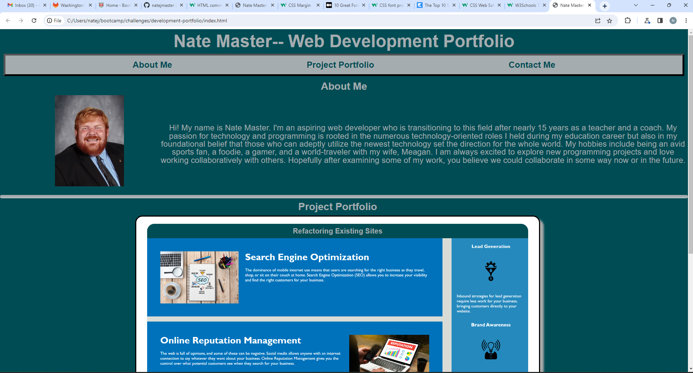

# development-portfolio
Challenge Description: The developers was tasked with utilizing knowledge of html and advanced CSS to create a personal portfolio that introduces the developer and highlights personal projects. Since this deployment is early in this developer's career, most project cards were made up of placefiller content that will be repopulated upon further challenge completions. Developers were instructed to make their sites accessible, interactive, and responsive.

Specific Skills Utilized: Beyond the standards of semantic html development displayed in the previous challenge, this project highlighted numerous CSS-specific skills including the following:
    -- Media Queries: The page features adaptive CSS that changes various elements of the page (especially the structure of the project cards and composition of the nav bar and about-me section) when faced with screens that are slimmer in width.
    -- Variable Selectors: To provide color uniformity, many of the colors utilized were included in a root element that allows for easy and adaptable design changes by color.
    --Pseudo-Selectors: Numerous elements, both links and images, adapt when hovered upon by the user's mouse, typically displaying a color change or background color change.
    -- Flexbox Display: The portfolio site features multiple flexbox containers that will modify how images and other content are displayed depending on screen dimensions.

    Link to Deployed Site:

    Screenshots of Deployed Site:

Screenshot example of Responsive Display:

